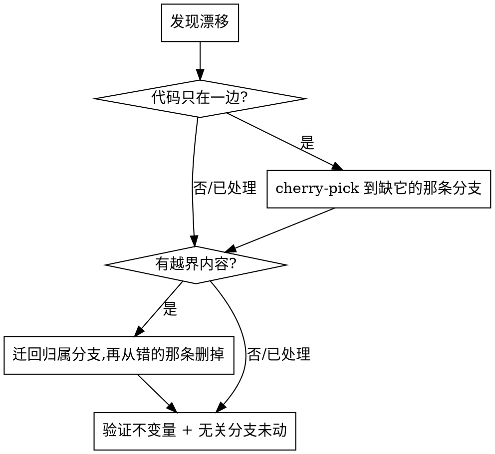

# Clean branch — 只让代码提交进那条干净分支

两条长期分支越漂越远，而 merge 是错的。出现在两种情况下：

- 分支有**角色分工**（A = 纯代码，B = 代码 + 文档/工具的超集），内容归属是有讲究的；或者
- 它们的历史被**各自独立改写过**（`filter-branch`、rebase、squash），hash 全不一样，
  merge 会把整段历史当新东西再引进来一遍。

对账的办法是：把缺的**代码**提交 cherry-pick 过去，把跑错地方的内容**迁移**回它该在的
分支 —— 永远不 merge。

## 可迁移的原则（换个项目也成立）

1. **先把每条分支的角色和不变量写下来。** 什么内容允许在哪。之后的迁移动作只是
   「让现实符合不变量」。
2. **历史被改写过的分支之间永不 merge。** hash 不同 → merge 会把一切当成重复内容
   再引进来。**只 cherry-pick。**
3. **历史改写不均匀时，不要相信 patch-id 类的探测。** `git cherry`、`git log A..B`、
   patch-id 在「同一个改动在两边被过滤成不同样子」时全都给假结果（典型：文档在两边
   被剔除的时间点不同）。**改用相关路径的真实 tree diff + subject 匹配。**
4. **按类型把内容迁回它的归属分支**，然后从不该待的地方删掉。
5. **维护一份显式的例外白名单** —— 那些看着越界、其实是**故意留着**的文件。删任何
   东西之前先查它。
6. **分支各自 checkout 在不同 worktree 时跨 worktree 操作**：一个分支不能被 checkout
   两次，用 `git -C "<那个 worktree>" ...`。
7. **纯本地的工具/调试分支绝不能推到共享远端。** 把个人工具（clangd 配置、脚手架、
   实验）拆到单独分支是为了让产品分支干净，那条分支**按设计就是本地的**，推上去就是
   污染公司仓。双保险：(a) 把「永不推送」写进项目记忆；(b) 加一道 git 层的闸 ——
   `git config branch.<name>.pushRemote no_push` 会让这条分支上裸 `git push` 失败
   （`no_push` 不是真的远端）。注意这道闸只挡隐式推送，显式 `git push origin <name>`
   仍然绕得过，所以别对这条分支写出远端名。

## 通用流程



- **代码漂移**：用代码路径的 tree diff 探测；按 subject 找到承载它的提交；旧→新
  cherry-pick 到缺它的那条分支。冲突手工解（真代码上**绝不**盲用 `-X theirs/ours`）。
- **越界内容**：先复制到归属分支提交，再从错的分支删掉（未跟踪就删文件；已跟踪就
  `git rm` 再提交）。在代码分支上加一条 ignore 规则通常能防它回来。

## 用法

```bash
py -3 "${CLAUDE_PLUGIN_ROOT}/scripts/CleanBranch.py" detect    # 同步点 + 待搬提交(附现成命令) + 漂移 + 越界文档；有待办则 exit 1
py -3 "${CLAUDE_PLUGIN_ROOT}/scripts/CleanBranch.py" verify    # 四项不变量 → PASS/FAIL；FAIL 则 exit 1
py -3 "${CLAUDE_PLUGIN_ROOT}/scripts/CleanBranch.py" --explain # 每个配置值来自全局层还是项目层

py -3 "${CLAUDE_PLUGIN_ROOT}/scripts/PickToClean.py" <commit>... # 工作分支→干净分支：过两道闸再 cherry-pick
```

**脚本只探测、只报告 —— 它从不 cherry-pick、从不迁移。** 冲突、迁移方向、白名单例外
都留给人当场判断。

worktree 路径在运行时从 `git worktree list` **自动解析**（在本仓库任一 worktree 内跑
即可），不写死绝对路径，换机器也活得下来。分支 ref、代码路径、白名单来自两层配置，
见下。

## 配置

分支 ref 和白名单**必须**配，工具不猜 —— 猜错的分支 ref 会让整轮跑在错的分支上，而且
看起来一切正常。缺键时脚本非零退出，并指出缺哪个键、该填什么、填到哪一层。

项目层 `<repo>/.repo-keeper.local.toml`：

```toml
[branches]
clean = "customer/xxx"          # 干净分支:纯代码,对外
work  = "task/xxx"              # 工作分支:代码 + 文档 + 工具(超集)

[paths]
code = ["App", "Boot", "drv", "bsp"]   # drift 以这些路径为准

[allow]
docs_on_clean = ["App/Code/xxx/说明.txt"]   # 合法的源码内文档,永不迁移/删除

[expected_drift]
# 两分支**刻意**永久不一致的文件。键=路径,值=为什么(必填 —— 不写理由的条目
# 会变成下一个人的谜,而这份名单是文件级的,一旦入列该文件将来的任何差异也不再报警)
"App/Code/drv/x.c" = "某次决策:work 保留重构,clean 已整体回退"

[never_pick]
# 永不从 clean 搬到 work 的提交。expected_drift 只让 verify 闭嘴,挡不住 detect
# 把它列成「待 cherry-pick」——照单执行会抹掉刻意保留的内容。**两个表都要填。**
"<40 位 hash>" = "为什么这条永远不搬"
```

全局层 `~/.repo-keeper/defaults.toml`（跨项目复用）：

```toml
[branches]
main = "main"                   # 只读核对,同步时绝不触碰
protected = ["main", "master"]

[paths]
doc_globs = ["*.md", "*.csv", "*.txt", "*.docx", "docs/"]

[identity]
# 身份跟着分支纯度走,不跟着仓库走:纯代码分支签对外身份,超集/工具分支签个人身份
clean = { name = "...", email = "..." }
work  = { name = "...", email = "..." }

[scan]
depth = 60                      # 匹配同步点时回看多少条提交
```

## `PickToClean.py` 的价值在动手之前

搬运本身就是 `git cherry-pick` 加一次作者归一。脚本存在的理由是它前面那两道闸，
它们各自对应一种**成功退出但结果是错的**：

- **文档守卫。** 干净分支的不变量是「每条提交只含代码」。一条混了文档的提交照样能
  pick 成功，于是文档静静地进了对外分支的记录，git 什么都不会说。所有 commit
  **一起**预检，任一命中就整体拒绝 —— 不能搬一半。
- **身份核对，是核对不是覆盖。** `--reset-author` 拿的是那个 worktree 的 git config，
  这是对的 —— git config 才是真相源。但一份新检出可能根本没配过，于是提交悄悄签上
  个人身份落进对外分支，而一切看起来都成功了。配了 `identity.clean` 时脚本先核对，
  对不上就在动手前停下并给出配置命令。

另外两条小的：**进行中的 cherry-pick 比脏工作区先报** —— 一场没收拾的冲突让两条同时
不满足，而先说「清理工作区」是把人往错路上指，清理解决不了它。以及 pick 出来是**空提交
时跳过而不是留个空壳**：内容已经在对面了，对外分支的记录里不该多一条什么都没改的提交。

## detect 的两道筛子

`detect` 用 **subject 匹配 + 代码路径 tree 相等**找同步点（不用 hash —— 见原则 3），
然后把它之后的干净分支提交列为「待 cherry-pick」，但会剔除已经同步过的：

1. **subject 已在对面** —— 便宜，但 subject 可以被改写；
2. **内容已在对面** —— 该提交改动的代码路径逐字节一致。专治
   *同一改动在两边以不同 subject 分别落地*，这种情况筛子 1 认不出来。这时 cherry-pick
   过去只会得到一个空提交或一次冲突。

工作分支保留刻意的本地分歧时（例如本机 `.clangd`），同步点会卡在它后面不动 —— 这正是
两道筛子都要存在的原因；那是预期状态，不是待办。

## verify 的三项不变量

1. **代码 drift 为空**，排除一类：*刻意漂移不算 drift* —— `expected_drift` 里的文件
   永久分歧、永不 FAIL。但它们仍会**连同 `diff --stat` 和你写的理由一起打印** ——
   白名单是文件级的，该文件*将来*的改动也不再 FAIL，打印出来的行数是唯一会提醒你的
   东西。名单要短。
2. **干净分支无越界文档**（白名单除外）。
3. **主分支 HEAD 未变**（人工核对；没配 `branches.main` 就跳过）。

## 常见错误

| 错误 | 实际情况 |
|---|---|
| 在两条分支间 `git merge` | 历史被改写过 → 一切重复一遍。**只 cherry-pick。** |
| 用 `git cherry`/`A..B`/patch-id 找漂移 | 历史改写不均匀时不可靠。用 tree diff + subject 匹配。 |
| 删掉白名单里的文件 | 那是故意留的。先查 `allow.docs_on_clean`。 |
| 把越界内容提交到代码分支 | 违反不变量。迁回它的归属分支。 |
| 动了主分支或无关分支 | 保持逐字节不变，永不纳入一次同步。 |
| 代码冲突盲用 `-X theirs/ours` | 固件冲突手工解。 |
| 工作分支→干净分支用裸 `git cherry-pick` | 文档会跟着进对外分支的记录，作者还签成个人身份，而且两样都成功退出。用 `PickToClean.py`。 |
| 为了让 FAIL 变绿而往 `expected_drift` 里加文件 | 这份名单的含义是「**按设计**永久分歧」，不是「还没搬」。加错一条，该文件将来的每次改动都会被藏起来。 |
| 看到 `detect` 列了提交就 pick，没先看 drift 是否非空 | drift 干净说明内容已经以别的 subject 在对面了，pick 只会得到空提交/冲突。`detect` 现在按内容过滤了这种，但执行前仍要自己看一眼。 |
| 干净分支签个人身份，或超集分支签对外身份 | 身份跟着纯度走。配 `identity.clean` 后 `PickToClean.py` 会替你把关。 |
| 用 filter-branch 改身份，改完发现文件也变了 | 纯身份改写必须让 tree 逐字节不变 —— 改写前后各查一次 `<ref>^{tree}`，动手前先备份分支。 |
| 刻意分歧只写了 `expected_drift` 没写 `never_pick` | `verify` 变绿，而 `detect` 仍把肇事提交列为待办。下一个人照着跑那条 cherry-pick，就把分歧静默撤销了。**两张表，永远一起填。** |
| 认定某个 revert 提交把该回退的都回退了 | 典型翻车：revert 删掉了驱动文件，却把配置头里对应的宏留成了死代码。宣布回退完成前，拿回退结果和改动前的基线 diff 一次（`git diff <pre-commit> -- <file>`）。 |
